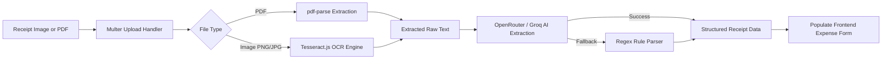
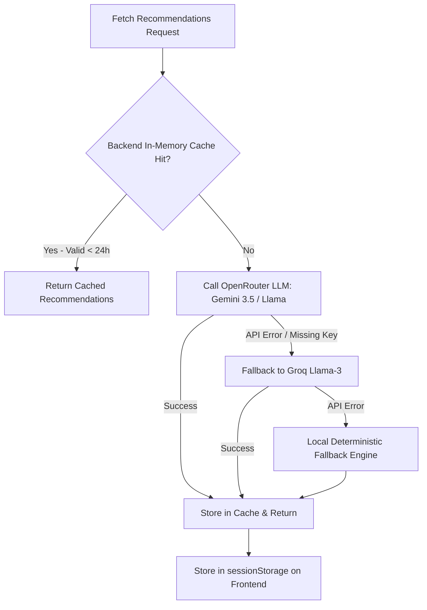
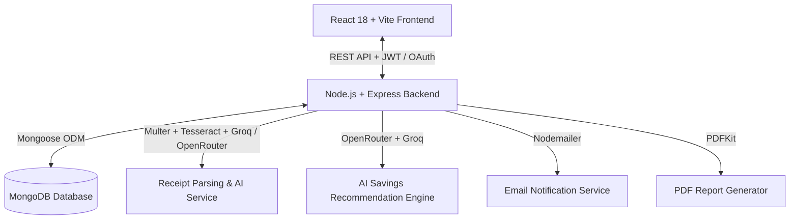

# 🌲 TripLedger — Collaborative Trip Planning & Expense Manager

> **A modern financial ledger, group itinerary planner, and expense management platform built with the MERN stack.**  
> Designed with a vintage national-park poster aesthetic (`nexus` design system), robust cost-sharing models, AI & OCR-assisted bill parsing, Google OAuth authentication, native **Indian Rupee (₹ / INR)** & UPI payment integration, interactive multi-day itinerary scheduling, hyper-localized AI savings recommendations, and automated minimum-transaction debt settlement.

---

> [!IMPORTANT]
> ### 🤖 Mandatory AI Agent & Contributor Guideline
> **Whenever an AI agent or contributor makes substantial modifications to this codebase** (such as adding or altering database models, introducing new API endpoints, modifying design tokens/styles, changing currency logic, adding npm packages, or altering core workflows), **they MUST update this `README.md` file to reflect those changes accurately.** This maintains project transparency and context for future AI agents and human collaborators.

---

## 📋 Table of Contents
1. [Overview & Product Vision](#-overview--product-vision)
2. [Key Features](#-key-features)
3. [Recent Accomplishments & Updates](#-recent-accomplishments--updates)
4. [Design System & UI Aesthetics (`nexus`)](#-design-system--ui-aesthetics-nexus)
5. [Indian Currency (INR / ₹) & Payment Methods](#-indian-currency-inr----payment-methods)
6. [AI & OCR Bill Parsing Engine](#-ai--ocr-bill-parsing-engine)
7. [Smart Group Itinerary Planning](#-smart-group-itinerary-planning)
8. [AI Group Savings Recommendations](#-ai-group-savings-recommendations)
9. [Architecture & Tech Stack](#-architecture--tech-stack)
10. [Directory Structure](#-directory-structure)
11. [Database Schemas & Data Models](#-database-schemas--data-models)
12. [API Endpoints Reference](#-api-endpoints-reference)
13. [Cost-Sharing & Debt Simplification Algorithms](#-cost-sharing--debt-simplification-algorithms)
14. [Setup & Running Locally](#-setup--running-locally)
15. [Project Documentation Index](#-project-documentation-index)
16. [AI Agent Maintenance Protocol](#-ai-agent-maintenance-protocol)

---

## 🌲 Overview & Product Vision

**TripLedger** solves the chaotic reality of group travel planning and finances. Unlike simple expense splitters, TripLedger accommodates variable arrival/departure dates, weighted accommodation nights, tiered cost multipliers, refunds, mid-trip money requests, multi-day itinerary timelines with live budget-to-actual rollups, side quest micro-groups, and multi-currency conversions.

### Core Philosophy
- **Transparent Calculations:** AI & OCR assist with receipt scanning, but financial decisions remain fully controllable and editable by users.
- **Fair Split Models:** Support for equal splits, stay-duration weighting, custom fixed amounts, side quest micro-groups, and room occupancy calculations.
- **Unified Itinerary & Finances:** Itinerary blocks link directly to bookings and expenses, giving real-time visibility into planned vs. actual costs and budget variances.
- **Minimum Transaction Settlement:** Reduces 20 criss-cross debts into a concise list of optimized transfers.
- **Vibrant Aesthetic:** Built using the `nexus` design theme — warm paper cream canvas paired with deep forest ink and vivid meadow green interactive elements.

---

## ✨ Key Features

- **Authentication & Security:**
  - Standard email/password registration & login with JSON Web Tokens (JWT).
  - One-click **Google OAuth 2.0** authentication (`@react-oauth/google` & `google-auth-library`).
  - Automatic welcome and security login alert emails via `nodemailer`.
  - Role management (**Host** vs **Member**) with Trip Invite Code joining.
- **Interactive Multi-Day Itinerary Engine:**
  - Daily time-block scheduling (`morning`, `afternoon`, `evening`, `night`, `all_day`, `custom`).
  - Direct financial linking: each block aggregates linked expenses and bookings.
  - Live budget variance tracking (Estimated Cost vs. Actual Cost, Over-Budget alerts, Untracked activity warnings).
  - Auto-generate itinerary timeline from trip duration and existing bookings.
  - Quick action to log expenses or scan receipts directly linked to an itinerary block.
- **AI Group Savings Recommendations:**
  - Hyper-localized, destination-specific cost-saving strategies powered by OpenRouter LLMs (`google/gemini-3.5-flash-lite`, `gemini-2.0-flash-lite-001`, or `meta-llama/llama-3.2-3b`) and Groq AI fallback.
  - Actionable advice across transit passes, group ticket bulk bookings, off-peak dining discounts, and shared accommodation tips.
  - Intelligent 24-hour server-side cache and client-side `sessionStorage` caching to prevent redundant API calls.
- **Side Quests & Subgroups:**
  - Isolate optional sub-group activities (e.g., scuba diving, rental cab, nightlife table) so only participating crew members share the expense without burdening the general trip pool.
- **Flexible Cost Sharing:**
  - **Equal Split:** Split expenses evenly among participants.
  - **Weighted Nights:** Pro-rate accommodation based on participant arrival/departure dates.
  - **Tiered Multipliers:** Assign multipliers (e.g. VIP 1.5x, Standard 1.0x, Budget 0.75x) for custom cost tiers.
  - **Occupancy-Based:** Split room costs based on occupant count per room/unit.
  - **Custom / Percentage / By-Item:** Pinpoint individual shares per expense item.
- **AI & OCR Bill Parsing Engine:**
  - Scan bill images (`PNG`, `JPG`) using **Tesseract.js** OCR.
  - Parse digital receipt PDFs using **pdf-parse**.
  - Extract structured merchant names, total amounts, dates, categories, and itemized splits via **OpenRouter** & **Groq AI** (`llama-3.3-70b-versatile` / `llama-3.1-8b-instant`) with automatic fallback regex pattern matching.
- **Settlement Engine:**
  - Dynamic balance calculations (`total_paid` vs `total_owed`).
  - Greedy debt-simplification algorithm to settle trip debts with minimal transfers.
  - Direct payment settlement tracking via **UPI ID** (Google Pay, PhonePe, Paytm), **Venmo**, and **PayPal**.
- **Audit Logging & History:** Comprehensive edit history tracking for expenses, itinerary changes, and participant adjustments.
- **PDF Report Generation:** Export formatted PDF trip ledger summaries complete with member breakdowns and settlement instructions (powered by `pdfkit`).
- **Interactive UI & Celebrations:** Custom modal views, tabbed workspace navigation, dynamic toast feedback, and confetti effects (`canvas-confetti`).

---

## 🚀 Recent Accomplishments & Updates

Here is a summary of features implemented across recent development milestones:

1. **Smart Itinerary Planning & Budget Rollup Engine:**
   - Created `ItineraryBlock.js` schema featuring day numbers, categorized time slots, locations, estimated budgets, and participant assignments.
   - Built backend `itineraryRoutes.js` supporting CRUD operations, auto-generation from trip dates & bookings, and automatic aggregation of linked expenses and bookings with cost variance calculations.
   - Created dedicated `ItineraryTab.jsx` component inside `TripWorkspace.jsx` complete with Day filters, summary stat cards, status toggles, and instant expense/receipt logging.
2. **AI Group Savings Recommendation Engine:**
   - Implemented `savingsService.js` and `recommendationRoutes.js` connecting to OpenRouter LLMs with Groq SDK fallback and local heuristic fallback.
   - Generates hyper-localized money-saving opportunities based on compulsory booking locations and trip destination.
   - Added two-tier caching: 24-hour in-memory backend cache plus frontend `sessionStorage` caching.
3. **Trip Invite Codes & Member Privileges:**
   - Added unique human-friendly invite codes (e.g., `EXP-XXXX`) for one-click trip joining.
   - Added host settings to control whether members can add expenses or require host approval (`Trip.settings.allowMemberExpenses`, `Trip.settings.requireHostApproval`).
   - Implemented Side Quests support in `Expense.js` and `Booking.js` allowing selective member participation.
4. **Bill Parsing & Receipt Scanner Feature:**
   - Enhanced `receiptService.js` supporting image OCR, PDF parsing, OpenRouter LLM extraction, Groq LLM extraction, and regex fallbacks.
   - Integrated drag-and-drop receipt scanning modal into `TripWorkspace.jsx` to auto-fill title, amount, category, date, and participants.
5. **Google OAuth 2.0 Authentication & Email System:**
   - Google Sign-In workflow on client (`@react-oauth/google`) and server (`google-auth-library`).
   - Integrated `emailService.js` using `nodemailer` for welcome and security login notifications.
6. **Indian Currency Integration (₹ / INR):**
   - Configured native **Indian Rupee (INR / ₹)** formatting according to `en-IN` standards.
   - Added **UPI ID** payment support for Indian payment apps (GPay, PhonePe, Paytm).

---

## 🎨 Design System & UI Aesthetics (`nexus`)

TripLedger adheres strictly to the **nexus** design specification ([`DESIGN.md`](file:///c:/Users/minil/Desktop/pillai/DESIGN.md)):

### Color Tokens
| Name | Hex Code | CSS Variable | Role / Usage |
| :--- | :--- | :--- | :--- |
| **Forest Ink** | `#122315` | `--color-forest-ink` | Hero background, nav bar, primary headings |
| **Meadow Green** | `#55dd4a` | `--color-meadow` | Primary CTA buttons, switch-on highlights, active badges |
| **Paper Cream** | `#f3ede4` | `--color-paper-cream` | Main background canvas, card surfaces on dark hero |
| **Sage Border** | `#566053` | `--color-sage-border` | Subtle green-gray borders, secondary dividers |
| **Lichen** | `#77e46e` | `--color-lichen` | Outline button borders, hover highlights |
| **Charcoal** | `#333333` | `--color-charcoal` | Dark body text on cream surfaces |
| **River Blue** | `#73d3eb` | `--color-river-blue` | Data visualizations, water/sky highlights |

---

## 🇮🇳 Indian Currency (INR / ₹) & Payment Methods

TripLedger includes native support for **Indian Rupee (INR / ₹)** and Indian digital payment rails:

1. **Currency Defaults & Formatting:**
   - Default trip currency options include `INR (₹)`, `USD ($)`, `EUR (€)`, `GBP (£)`, etc.
   - Formatted using `en-IN` locale standards (e.g. `₹1,50,000.00`).
2. **UPI Payment Integration:**
   - Participant profiles support **UPI ID** fields (e.g., `user@upi`, `name@okaxis`, `mobile@paytm`).
   - Settlement screens render direct payment tags for Google Pay, PhonePe, Paytm, Venmo, and PayPal.

---

## 🤖 AI & OCR Bill Parsing Engine

TripLedger features a multi-layer bill processing pipeline designed for speed and accuracy:



---

## 📅 Smart Group Itinerary Planning

The Itinerary module bridges schedule planning and expense tracking:

- **Time-Block Organization:** Plan activities across days and time slots (`morning`, `afternoon`, `evening`, `night`, `all_day`).
- **Financial Linking:** Link any booking or expense item to a specific itinerary time block.
- **Budget Variance Tracking:** Automatically calculates:
  $$\text{Variance} = \text{Actual Cost} - \text{Estimated Budget}$$
  Flags over-budget activities in red and untracked planned activities in amber.
- **Auto-Generate Timeline:** Converts existing confirmed bookings into structured itinerary blocks across the trip duration with a single click.

---

## 💡 AI Group Savings Recommendations

Powered by OpenRouter LLMs with Groq and heuristic fallbacks:



---

## 🏗 Architecture & Tech Stack



### Technology Stack
- **Frontend:**
  - React 18 (Vite build tool)
  - React Router DOM v6
  - `@react-oauth/google` for Google Sign-In
  - Lucide React Icons
  - Canvas Confetti
  - Custom Vanilla CSS (`index.css` design system)
- **Backend:**
  - Node.js & Express framework
  - MongoDB & Mongoose ORM
  - JSON Web Tokens (`jsonwebtoken`), `bcryptjs`, `google-auth-library`
  - `tesseract.js` (OCR image text extraction)
  - `pdf-parse` (PDF document text extraction)
  - `groq-sdk` & OpenRouter API (Structured AI bill extraction & savings recommendations)
  - `nodemailer` (Transactional welcome & login email alerts)
  - `multer` for multipart receipt file uploads
  - `pdfkit` for server-side PDF document rendering
  - `morgan` HTTP logger

---

## 📁 Directory Structure

```
pillai/
├── README.md                          # Main project guide & AI maintenance rules
├── DESIGN.md                          # Nexus design system token specifications
├── Trip_Planning_Product_Design.md    # Comprehensive product design & feature spec
├── GroupTrip_Ledger_Schema.md         # Database schema reference & field documentation
├── GroupTrip_Ledger_Cases.md          # Edge cases, join/leave logic & settlement rules
├── GroupTrip_Ledger_Decision_Matrix.md # Decision trees for complex financial scenarios
│
├── backend/                           # Node.js + Express REST API
│   ├── config/
│   │   └── db.js                      # MongoDB connection setup
│   ├── middleware/
│   │   └── auth.js                    # JWT Authentication middleware
│   ├── models/                        # Mongoose data schemas
│   │   ├── User.js                    # User account & payment handles
│   │   ├── Trip.js                    # Trip workspace, invite code & permissions
│   │   ├── Participant.js             # Members, arrival/departures, balance rollups
│   │   ├── ItineraryBlock.js          # Multi-day scheduling & financial rollup blocks
│   │   ├── Expense.js                 # Expense entries, side quests, receipt attachments
│   │   ├── Booking.js                 # Compulsory location bookings, models, costs
│   │   ├── Payment.js                 # Direct member-to-member payment records
│   │   ├── Refund.js                  # Refund transactions
│   │   ├── Settlement.js              # Calculated settlement transfers & states
│   │   ├── LedgerEntry.js             # Double-entry transaction audit records
│   │   └── AuditLog.js                # System security and change event log
│   ├── routes/                        # REST endpoint controllers
│   │   ├── authRoutes.js              # /api/v1/auth (Registration, Google OAuth, me)
│   │   ├── tripRoutes.js              # /api/v1/trips (CRUD, join with invite code)
│   │   ├── participantRoutes.js       # /api/v1/trips/:tripId/participants
│   │   ├── bookingRoutes.js           # /api/v1/trips/:tripId/bookings
│   │   ├── itineraryRoutes.js         # /api/v1/trips/:tripId/itinerary
│   │   ├── expenseRoutes.js           # /api/v1/trips/:tripId/expenses & /receipts
│   │   ├── paymentRoutes.js           # /api/v1/trips/:tripId/payments
│   │   ├── refundRoutes.js            # /api/v1/trips/:tripId/refunds
│   │   ├── settlementRoutes.js        # /api/v1/trips/:tripId/settlement
│   │   ├── ledgerRoutes.js            # /api/v1/trips/:tripId/ledger
│   │   ├── auditRoutes.js             # /api/v1/trips/:tripId/audit
│   │   ├── reportRoutes.js            # /api/v1/trips/:tripId/report (PDF generation)
│   │   └── recommendationRoutes.js    # /api/v1/trips/:tripId/recommendations
│   ├── services/                      # Business logic & algorithms
│   │   ├── calculationService.js      # Debt simplification & pro-rata engines
│   │   ├── emailService.js            # Nodemailer notification service
│   │   ├── receiptService.js          # Tesseract + Groq / OpenRouter AI receipt parser
│   │   ├── reportService.js           # PDF layout & document compilation
│   │   └── savingsService.js          # AI Group Savings recommendation generator
│   ├── uploads/                       # Static receipt storage directory
│   ├── .env                           # Backend environment variables
│   ├── package.json
│   └── server.js                      # Express application entry point
│
└── frontend/                          # React + Vite Client Application
    ├── src/
    │   ├── components/                # Reusable UI elements
    │   │   ├── Navbar.jsx             # Top navigation & user profile
    │   │   └── ItineraryTab.jsx       # Multi-day timeline, day filters & variance cards
    │   ├── context/                   # Global React contexts
    │   │   └── AuthContext.jsx
    │   ├── pages/                     # Full views / page routes
    │   │   ├── LandingPage.jsx        # Nexus aesthetic landing page
    │   │   ├── LoginPage.jsx          # Login view (Email & Google OAuth)
    │   │   ├── RegisterPage.jsx       # Registration view (Email & Google OAuth)
    │   │   ├── TripsPage.jsx          # Trip list & creation modal
    │   │   └── TripWorkspace.jsx      # Core workspace, tabs & receipt scanner modal
    │   ├── services/
    │   │   └── api.js                 # Axios/Fetch API client wrapper
    │   ├── App.jsx                    # Route mapping & layout wrapper
    │   ├── main.jsx                   # React root entry point
    │   └── index.css                  # CSS tokens & global design styles
    ├── package.json
    └── vite.config.js
```

---

## 📊 Database Schemas & Data Models

| Model | Primary Purpose | Key Fields |
| :--- | :--- | :--- |
| **`User`** | Platform user authentication & payment profiles | `name`, `email`, `password`, `googleId`, `avatar`, `role`, `upi_id`, `venmo_handle`, `paypal_email` |
| **`Trip`** | Core trip workspace entity | `name`, `destination`, `start_date`, `end_date`, `currency`, `budget`, `inviteCode`, `cost_sharing_model`, `organizer_id`, `settings` (`allowMemberExpenses`, `requireHostApproval`) |
| **`Participant`** | Members assigned to a trip | `trip_id`, `user_id`, `name`, `email`, `status`, `arrival_date`, `departure_date`, `cost_tier`, `tier_multiplier`, `total_owed`, `total_paid`, `balance`, `upi_id`, `venmo_handle` |
| **`ItineraryBlock`** | Multi-day activity blocks & financial rollups | `trip_id`, `day_number`, `date`, `time_slot`, `start_time`, `end_time`, `title`, `location`, `category`, `estimated_cost`, `currency`, `status`, `assigned_participants`, `notes` |
| **`Expense`** | Individual expense items | `tripId`, `payerId`, `amount`, `currency`, `category`, `isSideQuest`, `sideQuestTitle`, `itineraryBlockId`, `subgroupTag`, `participants`, `receiptUrl`, `aiParsed`, `status`, `editHistory` |
| **`Booking`** | Accommodation / transport / activity bookings | `trip_id`, `paid_by`, `description`, `location`, `total_cost`, `allocation_model`, `assigned_participants`, `itineraryBlockId`, `subgroupTag`, `status` |
| **`Payment`** | Direct member-to-member payments | `trip_id`, `payer_id`, `payee_id`, `amount`, `payment_method`, `payment_app`, `status`, `disputed` |
| **`Refund`** | Refund records for trip cancellations | `trip_id`, `participant_id`, `amount`, `refund_reason`, `refund_status` |
| **`Settlement`** | Optimized trip balance calculations | `tripId`, `status`, `balances`, `transactions_required`, `is_balanced`, `finalizedAt` |
| **`LedgerEntry`** | Double-entry record for auditability | `trip_id`, `entry_type`, `debit`, `credit`, `participant_id`, `balance_after`, `description` |
| **`AuditLog`** | Security and action change log | `tripId`, `action`, `actorId`, `actorName`, `target`, `changes`, `reason` |

---

## 🔌 API Endpoints Reference

### Authentication (`/api/v1/auth`)
- `POST /register` — Create new user account and auto-link pending trip invitations.
- `POST /login` — Authenticate user with email/password and receive JWT token.
- `POST /google` — Authenticate or sign up user using Google OAuth ID token.
- `GET /me` — Retrieve current authenticated user profile.
- `GET /members` — List registered platform members for quick trip addition.

### Trip Workspaces (`/api/v1/trips`)
- `GET /` — Fetch all trips where user is organizer or participant.
- `POST /` — Create a new trip workspace (auto-generates unique invite code).
- `POST /join` — Join a trip workspace using an invite code (`EXP-XXXX`).
- `GET /:tripId` — Fetch trip details, participants, expenses, bookings, itinerary blocks, and stats.
- `PUT /:tripId` — Update trip settings, host approval policies, budget, or dates.
- `DELETE /:tripId` — Permanently delete trip and all associated collection records.

### Itinerary Planning (`/api/v1/trips/:tripId/itinerary`)
- `GET /` — List all itinerary blocks with populated financial rollups (`actual_cost`, `variance`, `is_over_budget`, `is_untracked`).
- `POST /` — Create a new itinerary time block.
- `POST /auto-generate` — Auto-generate days from trip dates and convert existing bookings into time blocks.
- `PUT /:blockId` — Update time block parameters, dates, time slots, estimated costs, or status.
- `DELETE /:blockId` — Delete itinerary block and unlink associated expenses/bookings.

### AI Savings Recommendations (`/api/v1/trips/:tripId/recommendations`)
- `GET /` — Get AI-powered localized savings recommendations based on compulsory booking locations or destination.
- `POST /refresh` — Force re-generation of savings recommendations, bypassing cache.

### Participants (`/api/v1/trips/:tripId/participants`)
- `GET /` — List all members in a trip.
- `POST /` — Add a new member to the trip.
- `PUT /:participantId` — Update member status, arrival/departure dates, or UPI/Venmo handles.
- `POST /:participantId/depart` — Record early departure and trigger automatic stay-duration cost recalculation.
- `DELETE /:participantId` — Remove participant from trip.

### Expenses & Receipts (`/api/v1/trips/:tripId/expenses` & `/api/v1/receipts`)
- `GET /` — Fetch all trip expenses (filterable by category or status).
- `POST /` — Create new expense entry with custom split shares, optional side quest tag, and itinerary block link.
- `POST /scan-receipt` or `POST /api/v1/receipts/parse-receipt` — Upload receipt image or PDF for OCR and AI bill extraction.
- `GET /:expenseId` — Single expense details.
- `PUT /:expenseId` — Edit expense details (logs entry into edit history).
- `DELETE /:expenseId` — Soft-delete expense item (restricted to host or side quest creator).

### Bookings (`/api/v1/trips/:tripId/bookings`)
- `GET /` — List all bookings for the trip.
- `POST /` — Create new booking (requires compulsory location, dates, and allocation model).
- `PUT /:bookingId` — Update booking details, cost, or assigned participants.
- `DELETE /:bookingId` — Delete booking and rebalance participant shares.

### Settlements & Debt Simplification (`/api/v1/trips/:tripId/settlement`)
- `GET /` — Calculate current net balances and minimum required transactions.
- `POST /finalize` — Mark settlement as finalized and lock trip balances.
- `POST /record-payment` — Mark an individual settlement transfer transaction as completed.

### Payments & Refunds (`/api/v1/trips/:tripId/payments` & `/refunds`)
- `GET /` & `POST /` — Record and list direct member-to-member payments.
- `POST /:paymentId/dispute` — Dispute a recorded payment.
- `GET /` & `POST /` — Issue and view refund records.

### Ledger, Audits & Reports
- `GET /api/v1/trips/:tripId/ledger` — Unified double-entry financial ledger of all debits and credits.
- `GET /api/v1/trips/:tripId/audit` — View complete chronological audit log of all trip actions.
- `GET /api/v1/trips/:tripId/report` — View JSON summary report with category breakdowns and recommendations.
- `GET /api/v1/trips/:tripId/report/pdf` — Generate and stream PDF summary report.

---

## 🧮 Cost-Sharing & Debt Simplification Algorithms

### 1. Pro-Rata Overlap Nights (`calculationService.js`)
For accommodation costs split by `weighted_nights`:
$$\text{Overlap Nights} = \max(0, \min(\text{Departure}_P, \text{CheckOut}) - \max(\text{Arrival}_P, \text{CheckIn}))$$
$$\text{Participant Share} = \left( \frac{\text{Participant Overlap Nights}}{\sum \text{All Participant Overlap Nights}} \right) \times \text{Total Cost}$$

### 2. Minimum Transaction Debt Settlement
TripLedger computes each participant's `net_balance = total_owed - total_paid`:
- **Debtors (`net_balance > 0`):** Participants who must pay into the group pool.
- **Creditors (`net_balance < 0`):** Participants who are owed money back.

A greedy algorithm pairs the largest debtor with the largest creditor, creating a transfer for $\min(\text{debtor\_remaining}, \text{creditor\_remaining})$ until all balances net out to $0.00$.

---

## 🚀 Setup & Running Locally

### Prerequisites
- Node.js (v18 or higher)
- MongoDB instance (Local or MongoDB Atlas)
- npm or yarn

### 1. Environment Configuration

Create a `.env` file in `backend/`:

```env
PORT=5000
MONGODB_URI=mongodb://localhost:27017/tripledger
JWT_SECRET=your_super_secret_jwt_key_here
CLIENT_URL=http://localhost:5173
GOOGLE_CLIENT_ID=your_google_client_id_here
GROQ_API_KEY=your_groq_api_key_here
OPENROUTER_API_KEY=your_openrouter_api_key_here
OPENROUTER_MODEL=google/gemini-3.5-flash-lite

# Optional SMTP Email Settings (nodemailer)
SMTP_HOST=smtp.gmail.com
SMTP_PORT=587
EMAIL_USER=your_email@gmail.com
EMAIL_PASS=your_app_password
EMAIL_FROM="TripLedger <welcome@tripledger.com>"
```

Create a `.env` file in `frontend/`:

```env
VITE_API_BASE_URL=http://localhost:5000/api/v1
VITE_GOOGLE_CLIENT_ID=your_google_client_id_here
```

### 2. Backend Setup
```bash
cd backend
npm install
npm run dev
```
*The backend server will start on `http://localhost:5000`.*

### 3. Frontend Setup
```bash
cd frontend
npm install
npm run dev
```
*The Vite frontend server will start on `http://localhost:5173`.*

---

## 📚 Project Documentation Index

For deeper domain knowledge and implementation guidelines, refer to the root markdown specifications:

1. **[`DESIGN.md`](file:///c:/Users/minil/Desktop/pillai/DESIGN.md):** `nexus` theme guidelines, full typography scale, CSS token definitions, and UI components.
2. **[`Trip_Planning_Product_Design.md`](file:///c:/Users/minil/Desktop/pillai/Trip_Planning_Product_Design.md):** Comprehensive product roadmap, user journeys (Host vs Member), and UX guidelines.
3. **[`GroupTrip_Ledger_Schema.md`](file:///c:/Users/minil/Desktop/pillai/GroupTrip_Ledger_Schema.md):** Detailed field types, indexes, and validation rules for all 10 MongoDB collections.
4. **[`GroupTrip_Ledger_Cases.md`](file:///c:/Users/minil/Desktop/pillai/GroupTrip_Ledger_Cases.md):** Edge case specifications (late joins, early departures, ghosting members, refunds).
5. **[`GroupTrip_Ledger_Decision_Matrix.md`](file:///c:/Users/minil/Desktop/pillai/GroupTrip_Ledger_Decision_Matrix.md):** Financial decision trees and recommended resolution paths for complex scenario handling.

---

## 🤖 AI Agent Maintenance Protocol

To ensure seamless collaboration across multiple AI coding assistants (and human developers):

> [!CAUTION]
> ### Rules for Updating Codebase & Documentation
> 1. **Keep `README.md` In Sync:** If you create a new backend route, add a model attribute, install a package, alter the design system tokens, or change currency handling, **you MUST update `README.md` in the same task turn**.
> 2. **Respect `nexus` Design Tokens:** Never inline plain hex colors like `#000` or `#fff` in new React components — always use the CSS variables defined in `index.css` (e.g. `var(--color-forest-ink)`, `var(--color-meadow)`).
> 3. **Preserve API Contracts:** When updating model schemas or route parameters, ensure corresponding frontend API calls in `frontend/src/services/api.js` and page components are kept in sync.
> 4. **Currency Awareness:** Ensure all money input and display fields handle both single-currency and multi-currency formats, respecting symbol rendering for **₹**, **$**, **€**, and **£**.
