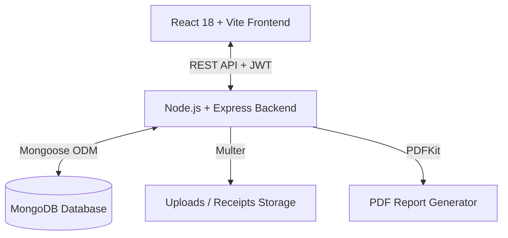

# 🌲 TripLedger — Collaborative Trip Planning & Expense Manager

> **A modern financial ledger and trip planning application built with the MERN stack.**  
> Designed with a vintage national-park poster aesthetic (`nexus` design system), robust cost-sharing models, AI-assisted receipt parsing, multi-currency support (including native **Indian Rupee ₹** & UPI), and automated minimum-transaction debt settlement.

---

> [!IMPORTANT]
> ### 🤖 Mandatory AI Agent & Contributor Guideline
> **Whenever an AI agent or contributor makes substantial modifications to this codebase** (such as adding or altering database models, introducing new API endpoints, modifying design tokens/styles, changing currency logic, adding npm packages, or altering core workflows), **they MUST update this `README.md` file to reflect those changes accurately.** This maintains project transparency and context for future AI agents and human collaborators.

---

## 📋 Table of Contents
1. [Overview & Product Vision](#-overview--product-vision)
2. [Key Features](#-key-features)
3. [Design System & UI Aesthetics (`nexus`)](#-design-system--ui-aesthetics-nexus)
4. [Indian Currency (INR / ₹) & Payment Methods](#-indian-currency-inr----payment-methods)
5. [Architecture & Tech Stack](#-architecture--tech-stack)
6. [Directory Structure](#-directory-structure)
7. [Database Schemas & Data Models](#-database-schemas--data-models)
8. [API Endpoints Reference](#-api-endpoints-reference)
9. [Cost-Sharing & Debt Simplification Algorithms](#-cost-sharing--debt-simplification-algorithms)
10. [Setup & Running Locally](#-setup--running-locally)
11. [Project Documentation Index](#-project-documentation-index)
12. [AI Agent Maintenance Protocol](#-ai-agent-maintenance-protocol)

---

## 🌲 Overview & Product Vision

**TripLedger** solves the messy reality of group travel finances. Unlike simple expense splitters, TripLedger accommodates variable arrival/departure dates, weighted accommodation nights, tiered cost multipliers, refunds, mid-trip money requests, and multi-currency conversions.

### Core Philosophy
- **Transparent Calculations:** AI assists with receipt scanning, but financial decisions remain in the hands of users.
- **Fair Split Models:** Support for equal splits, stay-duration weighting, custom fixed amounts, and room occupancy calculations.
- **Minimum Transaction Settlement:** Reduces 20 criss-cross debts into a concise list of optimized transfers.
- **Vibrant Aesthetic:** Built using the `nexus` design theme — warm paper cream canvas paired with deep forest ink and vivid meadow green interactive elements.

---

## ✨ Key Features

- **Authenticated Trip Workspaces:** Secure JWT user accounts with multi-trip support, roles (Organizer vs Participant), and invite management.
- **Flexible Cost Sharing:**
  - **Equal Split:** Split expenses evenly among participants.
  - **Weighted Nights:** Pro-rate accommodation based on participant arrival/departure dates.
  - **Tiered Multipliers:** Assign multipliers (e.g. VIP 1.5x, Standard 1.0x, Budget 0.75x) for custom cost tiers.
  - **Occupancy-Based:** Split room costs based on occupant count per room/unit.
  - **Custom / Percentage / By-Item:** Pinpoint individual shares per expense item.
- **AI Receipt Scanning:** Upload receipt images (`Multer`) to automatically extract merchant, date, total, and itemized splits.
- **Settlement Engine:**
  - Dynamic balance calculations (`total_paid` vs `total_owed`).
  - Greedy debt-simplification algorithm to settle trip debts with minimal transfers.
  - Direct payment settlement tracking via **UPI ID**, **Venmo**, and **PayPal**.
- **Audit Logging & History:** Comprehensive edit history tracking for expenses and participant changes.
- **PDF Report Generation:** Export formatted PDF trip ledger summaries complete with member breakdowns and settlement instructions (powered by `pdfkit`).
- **Interactive UI & Celebrations:** Built with custom modal views, tabbed workspace navigation, dynamic toast feedback, and confetti effects (`canvas-confetti`).

---

## 🎨 Design System & UI Aesthetics (`nexus`)

TripLedger adheres strictly to the **nexus** design specification (`DESIGN.md`):

### Color Tokens
| Name | Hex Code | CSS Variable | Role / Usage |
| :--- | :--- | :--- | :--- |
| **Forest Ink** | `#122315` | `--color-forest-ink` | Hero background, nav bar, primary headings |
| **Meadow Green** | `#55dd4a` | `--color-meadow` | Primary CTA buttons, switch-on highlights, active badges |
| **Paper Cream** | `#f3ede4` | `--color-paper-cream` | Main background canvas, card surfaces on dark hero |
| **Sage Border** | `#566053` | `--color-sage-border` | Subtle green-gray borders, secondary dividers |
| **Lichen** | `#77e46e` | `--color-lichen` | Outline button borders, hover highlights |
| **Charcoal** | `#333333` | `--color-charcoal` | Dark body text on cream surfaces |
| **River Blue** | `#73d3eb` | `--color-river-blue` | Data visualizations, water/sky highlights |

### Typography
- **Headlines / Display:** `Deacon`, `Bebas Neue`, or `Oswald` (ultra-condensed sans, line-height ~0.85).
- **Body / UI:** `Graphik` or `Inter` (clean humanist geometric sans).

---

## 🇮🇳 Indian Currency (INR / ₹) & Payment Methods

TripLedger includes native support for **Indian Rupee (INR / ₹)** and Indian digital payment rails:

1. **Currency Defaults & Formatting:**
   - Default trip currency options include `INR (₹)`, `USD ($)`, `EUR (€)`, `GBP (£)`, etc.
   - Formatted using `en-IN` locale standards (e.g. `₹1,50,000.00`).
2. **UPI Payment Integration:**
   - Participant profiles support **UPI ID** fields (e.g., `user@upi`, `name@okaxis`, `mobile@paytm`).
   - Settlement screens render direct payment tags for Google Pay, PhonePe, Paytm, Venmo, and PayPal.

---

## 🏗 Architecture & Tech Stack



### Technology Stack
- **Frontend:**
  - React 18 (Vite build tool)
  - React Router DOM v6
  - Lucide React Icons
  - Canvas Confetti
  - Custom Vanilla CSS (`index.css` design system)
- **Backend:**
  - Node.js & Express framework
  - MongoDB & Mongoose ORM
  - JSON Web Tokens (`jsonwebtoken`) & `bcryptjs`
  - `multer` for multipart image uploads
  - `pdfkit` for server-side PDF document rendering
  - `morgan` HTTP logger

---

## 📁 Directory Structure

```
pillai/
├── README.md                          # Main project guide & AI maintenance rules
├── DESIGN.md                          # Nexus design system token specifications
├── Trip_Planning_Product_Design.md    # Comprehensive product design & feature spec
├── GroupTrip_Ledger_Schema.md         # Database schema reference & field documentation
├── GroupTrip_Ledger_Cases.md          # Edge cases, join/leave logic & settlement rules
├── GroupTrip_Ledger_Decision_Matrix.md # Decision trees for complex financial scenarios
│
├── backend/                           # Node.js + Express REST API
│   ├── config/
│   │   └── db.js                      # MongoDB connection setup
│   ├── middleware/
│   │   └── auth.js                    # JWT Authentication middleware
│   ├── models/                        # Mongoose data schemas
│   │   ├── User.js
│   │   ├── Trip.js
│   │   ├── Participant.js
│   │   ├── Expense.js
│   │   ├── Booking.js
│   │   ├── Payment.js
│   │   ├── Refund.js
│   │   ├── Settlement.js
│   │   ├── LedgerEntry.js
│   │   └── AuditLog.js
│   ├── routes/                        # REST endpoint controllers
│   │   ├── authRoutes.js              # /api/v1/auth
│   │   ├── tripRoutes.js              # /api/v1/trips
│   │   ├── participantRoutes.js       # /api/v1/trips/:id/participants
│   │   ├── bookingRoutes.js           # /api/v1/trips/:id/bookings
│   │   ├── expenseRoutes.js           # /api/v1/trips/:id/expenses & /api/v1/receipts
│   │   ├── paymentRoutes.js           # /api/v1/trips/:id/payments
│   │   ├── refundRoutes.js            # /api/v1/trips/:id/refunds
│   │   ├── settlementRoutes.js        # /api/v1/trips/:id/settlement
│   │   ├── ledgerRoutes.js            # /api/v1/trips/:id/ledger
│   │   ├── auditRoutes.js             # /api/v1/trips/:id/audit
│   │   └── reportRoutes.js            # /api/v1/trips/:id/report (PDF generation)
│   ├── services/                      # Business logic & algorithms
│   │   ├── calculationService.js      # Debt simplification & pro-rata engines
│   │   ├── receiptService.js          # AI OCR receipt parser simulation
│   │   └── reportService.js           # PDF layout & document compilation
│   ├── uploads/                       # Static receipt storage directory
│   ├── .env                           # Backend environment variables
│   ├── package.json
│   └── server.js                      # Express application entry point
│
└── frontend/                          # React + Vite Client Application
    ├── src/
    │   ├── components/                # Reusable UI elements (Navbar, Modals)
    │   │   └── Navbar.jsx
    │   ├── context/                   # Global React contexts
    │   │   └── AuthContext.jsx
    │   ├── pages/                     # Full views / page routes
    │   │   ├── LandingPage.jsx        # Nexus aesthetic landing page
    │   │   ├── LoginPage.jsx          # Login view
    │   │   ├── RegisterPage.jsx       # Registration view
    │   │   ├── TripsPage.jsx          # Trip list & creation modal
    │   │   └── TripWorkspace.jsx      # Core trip management workspace
    │   ├── services/
    │   │   └── api.js                 # Axios/Fetch API client wrapper
    │   ├── App.jsx                    # Route mapping & layout wrapper
    │   ├── main.jsx                   # React root entry point
    │   └── index.css                  # CSS tokens & global design styles
    ├── package.json
    └── vite.config.js
```

---

## 📊 Database Schemas & Data Models

| Model | Primary Purpose | Key Fields |
| :--- | :--- | :--- |
| **`User`** | Platform user authentication | `name`, `email`, `password`, `default_currency` |
| **`Trip`** | Core trip workspace entity | `name`, `destination`, `start_date`, `end_date`, `currency`, `budget`, `cost_sharing_model`, `organizer_id` |
| **`Participant`** | Members assigned to a trip | `trip_id`, `user_id`, `name`, `email`, `status`, `arrival_date`, `departure_date`, `cost_tier`, `tier_multiplier`, `total_owed`, `total_paid`, `balance`, `upi_id`, `venmo_handle` |
| **`Expense`** | Individual expense items | `tripId`, `payerId`, `amount`, `currency`, `category`, `participants` (shares), `receiptUrl`, `aiParsed`, `status` |
| **`Booking`** | Accommodation / flight bookings | `trip_id`, `paid_by`, `total_cost`, `allocation_model`, `assigned_participants` |
| **`Payment`** | Direct member-to-member payments | `trip_id`, `payer_id`, `payee_id`, `amount`, `payment_method`, `status` |
| **`Refund`** | Refund records for trip cancellations | `trip_id`, `participant_id`, `amount`, `reason`, `status` |
| **`Settlement`** | Optimized trip balance calculations | `tripId`, `status`, `balances`, `transactions_required`, `is_balanced` |
| **`LedgerEntry`** | Double-entry record for auditability | `trip_id`, `type`, `amount`, `payer_id`, `beneficiaries` |
| **`AuditLog`** | Security and action change log | `trip_id`, `actor_id`, `action`, `entity_type`, `changes` |

---

## 🔌 API Endpoints Reference

### Authentication (`/api/v1/auth`)
- `POST /register` — Create new user account.
- `POST /login` — Authenticate user and receive JWT token.
- `GET /me` — Retrieve current authenticated user profile.

### Trip Workspaces (`/api/v1/trips`)
- `GET /` — Fetch all trips where user is organizer or participant.
- `POST /` — Create a new trip workspace.
- `GET /:id` — Fetch trip details.
- `PUT /:id` — Update trip settings, budget, or dates.
- `DELETE /:id` — Delete a trip workspace.

### Participants (`/api/v1/trips/:tripId/participants`)
- `GET /` — List all members in a trip.
- `POST /` — Add a new member to the trip.
- `PUT /:participantId` — Update member status, arrival/departure dates, or UPI/Venmo handles.
- `DELETE /:participantId` — Remove participant from trip.

### Expenses & Receipts (`/api/v1/trips/:tripId/expenses` & `/api/v1/receipts`)
- `GET /` — Fetch all trip expenses.
- `POST /` — Create new expense entry with custom split shares.
- `PUT /:expenseId` — Edit expense details (logs entry into edit history).
- `DELETE /:expenseId` — Soft-delete expense item.
- `POST /api/v1/receipts/parse` — Upload receipt image file (`receipt` field) for AI parsing.

### Settlements & Debt Simplification (`/api/v1/trips/:tripId/settlement`)
- `GET /` — Calculate current net balances and minimum required transactions.
- `POST /finalize` — Mark settlement as completed and finalize trip balances.

### Reports (`/api/v1/trips/:tripId/report`)
- `GET /download` — Generate and stream PDF summary report for the trip.

---

## 🧮 Cost-Sharing & Debt Simplification Algorithms

### 1. Pro-Rata Overlap Nights (`calculationService.js`)
For accommodation costs split by `weighted_nights`:
$$\text{Overlap Nights} = \max(0, \min(\text{Departure}_P, \text{CheckOut}) - \max(\text{Arrival}_P, \text{CheckIn}))$$
$$\text{Participant Share} = \left( \frac{\text{Participant Overlap Nights}}{\sum \text{All Participant Overlap Nights}} \right) \times \text{Total Cost}$$

### 2. Minimum Transaction Debt Settlement
TripLedger computes each participant's `net_balance = total_owed - total_paid`:
- **Debtors (`net_balance > 0`):** Participants who must pay into the group pool.
- **Creditors (`net_balance < 0`):** Participants who are owed money back.

A greedy algorithm pairs the largest debtor with the largest creditor, creating a transfer for $\min(\text{debtor\_remaining}, \text{creditor\_remaining})$ until all balances net out to $0.00$.

---

## 🚀 Setup & Running Locally

### Prerequisites
- Node.js (v18 or higher)
- MongoDB instance (Local or MongoDB Atlas)
- npm or yarn

### 1. Environment Configuration
Create a `.env` file in `backend/`:

```env
PORT=5000
MONGO_URI=mongodb://localhost:27017/tripledger
JWT_SECRET=your_super_secret_jwt_key_here
CLIENT_URL=http://localhost:5173
```

### 2. Backend Setup
```bash
cd backend
npm install
npm run dev
```
*The backend server will start on `http://localhost:5000`.*

### 3. Frontend Setup
```bash
cd frontend
npm install
npm run dev
```
*The Vite frontend server will start on `http://localhost:5173`.*

---

## 📚 Project Documentation Index

For deeper domain knowledge and implementation guidelines, refer to the root markdown specifications:

1. **[`DESIGN.md`](file:///c:/Users/minil/Desktop/pillai/DESIGN.md):** `nexus` theme guidelines, full typography scale, CSS token definitions, and UI components.
2. **[`Trip_Planning_Product_Design.md`](file:///c:/Users/minil/Desktop/pillai/Trip_Planning_Product_Design.md):** Comprehensive product roadmap, user journeys (Host vs Member), and UX guidelines.
3. **[`GroupTrip_Ledger_Schema.md`](file:///c:/Users/minil/Desktop/pillai/GroupTrip_Ledger_Schema.md):** Detailed field types, indexes, and validation rules for all 10 MongoDB collections.
4. **[`GroupTrip_Ledger_Cases.md`](file:///c:/Users/minil/Desktop/pillai/GroupTrip_Ledger_Cases.md):** Edge case specifications (late joins, early departures, ghosting members, refunds).
5. **[`GroupTrip_Ledger_Decision_Matrix.md`](file:///c:/Users/minil/Desktop/pillai/GroupTrip_Ledger_Decision_Matrix.md):** Financial decision trees and recommended resolution paths for complex scenario handling.

---

## 🤖 AI Agent Maintenance Protocol

To ensure seamless collaboration across multiple AI coding assistants (and human developers):

> [!CAUTION]
> ### Rules for Updating Codebase & Documentation
> 1. **Keep `README.md` In Sync:** If you create a new backend route, add a model attribute, install a package, alter the design system tokens, or change currency handling, **you MUST update `README.md` in the same task turn**.
> 2. **Respect `nexus` Design Tokens:** Never inline plain hex colors like `#000` or `#fff` in new React components — always use the CSS variables defined in `index.css` (e.g. `var(--color-forest-ink)`, `var(--color-meadow)`).
> 3. **Preserve API Contracts:** When updating model schemas or route parameters, ensure corresponding frontend API calls in `frontend/src/services/api.js` and page components are kept in sync.
> 4. **Currency Awareness:** Ensure all money input and display fields handle both single-currency and multi-currency formats, respecting symbol rendering for **₹**, **$**, **€**, and **£**.
